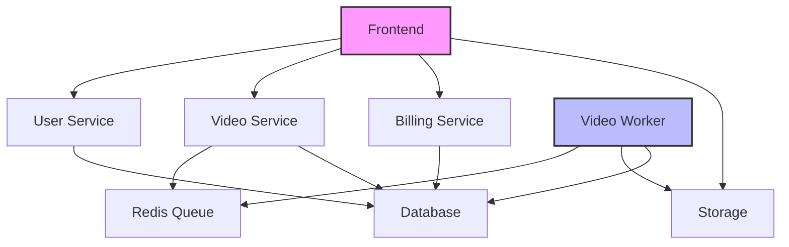

# System Architecture

## Overview

Ravid Clipping uses a microservices architecture with 8 core containers, each handling specific responsibilities in the video processing pipeline.

## System Components

### 1. Frontend Service (Port: 3000)
- **Technology**: Next.js
- **Purpose**: User interface and client-side application
- **Features**:
  - Responsive dashboard
  - Video upload interface
  - Real-time processing status
  - Clip preview and download
  - Token purchase flow

### 2. User Service (Port: 8001)
- **Technology**: Node.js + Express
- **Purpose**: Authentication and user management
- **Features**:
  - User registration
  - JWT-based authentication
  - Profile management
  - Session handling

### 3. Video Service (Port: 8002)
- **Technology**: Node.js + Express
- **Purpose**: Video processing API and job management
- **Features**:
  - Video upload coordination
  - Job status tracking
  - Clip metadata management
  - Download URL generation

### 4. Video Worker (Port: 8004)
- **Technology**: Python + PyTorch
- **Purpose**: AI-powered video processing
- **Features**:
  - Scene detection model
  - Whisper integration
  - Subtitle generation
  - Clip creation
  - Video encoding

### 5. Billing Service (Port: 8003)
- **Technology**: Node.js + Express
- **Purpose**: Token and payment management
- **Features**:
  - Token purchase
  - Balance tracking
  - Payment processing
  - Usage accounting

### 6. Database (Port: 5432)
- **Technology**: PostgreSQL
- **Purpose**: Persistent data storage
- **Key Tables**:
  - Users
  - Videos
  - Clips
  - Jobs
  - Tokens
  - Transactions

### 7. Redis (Port: 6379)
- **Technology**: Redis
- **Purpose**: Job queue and caching
- **Features**:
  - Processing queue
  - Job status caching
  - Rate limiting
  - Session storage

### 8. Storage (Port: 9000)
- **Technology**: MinIO
- **Purpose**: Video file storage
- **Features**:
  - Source video storage
  - Generated clip storage
  - Temporary processing storage
  - Pre-signed URL generation

## Container Communication

## Data Flow

### 1. Video Upload Flow
1. User uploads video to Storage via Frontend
2. Frontend notifies Video Service
3. Video Service creates job in Redis Queue
4. Video Worker picks up job
5. Worker processes video and stores clips
6. Job status updated in Database

### 2. Authentication Flow
1. User credentials sent to User Service
2. User Service validates with Database
3. JWT token generated and returned
4. Frontend stores token for future requests

### 3. Token Purchase Flow
1. User initiates purchase via Frontend
2. Billing Service processes payment
3. Token balance updated in Database
4. Frontend reflects new balance

## Scaling Considerations

### Horizontal Scaling
- Video Workers can be scaled based on queue size
- Frontend can be scaled for traffic spikes
- API services can be load balanced

### Database Scaling
- Read replicas for query optimization
- Partitioning for large datasets
- Backup and recovery strategy

### Storage Scaling
- MinIO distributed mode
- CDN integration for downloads
- Automatic cleanup of temporary files

## Security Measures

### Authentication
- JWT-based token system
- Secure password hashing
- Rate limiting on auth endpoints

### Data Protection
- Encrypted storage
- Secure file transfers
- Temporary URL access

### API Security
- CORS policies
- Input validation
- Request sanitization

## Monitoring

### Key Metrics
- Processing queue length
- Worker performance
- API response times
- Storage usage
- Token consumption

### Health Checks
- Container health monitoring
- Database connection status
- Queue system availability
- Storage system status

## Deployment

### Container Orchestration
- Kubernetes cluster management
- Auto-scaling policies
- Resource allocation
- Load balancing

### CI/CD Pipeline
- Automated testing
- Container builds
- Deployment automation
- Rollback procedures

## Future Considerations

### Potential Enhancements
- Multi-region deployment
- Advanced AI models
- Real-time processing
- Social media integration
- Analytics dashboard 