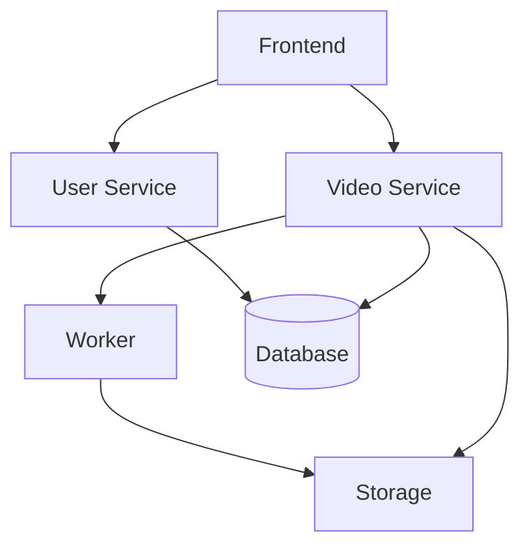

# Ravid Clipping MVP

## Core Value Proposition
Create short, engaging clips from YouTube videos with auto-generated captions, focusing on the most basic yet valuable features that demonstrate the product's potential.

## MVP Features

### 1. Basic Authentication
- Email/password registration and login
- JWT-based authentication
- Simple user profile
- No social login initially
- No password recovery in MVP

### 2. Simplified Token System
- Single token package (10 tokens)
- Basic payment integration (one payment provider)
- Manual token deduction
- No refunds in MVP
- No subscription model

### 3. Core Video Processing
- YouTube URL input only
- Fixed clip duration (30 seconds)
- Basic scene detection
- Simple Whisper integration for captions
- Single caption style
- No custom clip duration
- No advanced editing features

### 4. Basic User Interface
- Clean, functional design
- Video input page
- Processing status page
- Clips library
- Basic error handling
- No advanced customization
- No drag-and-drop

## Technical Scope

### Frontend (Next.js)
```typescript
// Key Components
- AuthPage
- DashboardPage
- VideoInputPage
- ClipsLibraryPage
- ProcessingStatusPage

// Core Features
- YouTube URL validation
- Basic token display
- Simple clip preview
- Download button
```

### User Service
```typescript
// Essential Endpoints
POST /api/auth/register
POST /api/auth/login
GET /api/users/me

// Core Models
User {
  id: string
  email: string
  password: string
  tokenBalance: number
}
```

### Video Service
```typescript
// Essential Endpoints
POST /api/videos/process
GET /api/videos/{id}/status
GET /api/videos/list

// Core Models
Video {
  id: string
  userId: string
  youtubeUrl: string
  status: 'pending' | 'processing' | 'completed' | 'failed'
  clips: Clip[]
}

Clip {
  id: string
  videoId: string
  url: string
  duration: number
}
```

### Worker Service
```python
# Core Functions
- YouTube video download
- Basic scene detection
- Whisper transcription
- Simple clip generation
- Caption embedding
```

### Storage
```
/videos/
  /{userId}/
    /{videoId}/
      - original.mp4
      - clip_{id}.mp4
```

## MVP Architecture



## Database Schema

### MVP Tables
```sql
-- Users
CREATE TABLE users (
    id UUID PRIMARY KEY,
    email VARCHAR(255) UNIQUE,
    password_hash VARCHAR(255),
    token_balance INTEGER DEFAULT 0,
    created_at TIMESTAMP DEFAULT NOW()
);

-- Videos
CREATE TABLE videos (
    id UUID PRIMARY KEY,
    user_id UUID REFERENCES users(id),
    youtube_url TEXT,
    status VARCHAR(50),
    created_at TIMESTAMP DEFAULT NOW()
);

-- Clips
CREATE TABLE clips (
    id UUID PRIMARY KEY,
    video_id UUID REFERENCES videos(id),
    storage_path TEXT,
    duration INTEGER,
    created_at TIMESTAMP DEFAULT NOW()
);
```

## MVP Development Phases

### 1. Foundation (Required)
- Basic user authentication
- Simple frontend structure
- Core database setup
- Basic API endpoints

### 2. Core Processing (Required)
- YouTube video download
- Basic scene detection
- Simple clip generation
- Basic caption generation

### 3. Essential Features (Required)
- Token purchase (single package)
- Clip storage and retrieval
- Basic error handling
- Simple user dashboard

### 4. Nice to Have (If Time Permits)
- Basic analytics
- Simple share functionality
- Basic clip preview
- Error notifications

## MVP Success Metrics

### Must Have
- Users can register and login
- Users can purchase tokens
- Users can input YouTube URLs
- System can generate basic clips
- Users can download clips

### Should Have
- Basic error messages
- Processing status updates
- Simple clip preview
- Basic token management

### Could Have
- Simple analytics
- Basic share functionality
- Processing notifications
- Simple user profile

## MVP Limitations

### Intentionally Excluded
1. **Advanced Features**
   - Custom clip duration
   - Multiple caption styles
   - Advanced editing tools
   - Social login

2. **Complex Processing**
   - Multiple AI models
   - Advanced scene detection
   - Custom caption positioning
   - Multiple output formats

3. **Business Features**
   - Subscription model
   - Multiple token packages
   - Refund system
   - Team accounts

4. **Technical Features**
   - Advanced caching
   - Real-time processing
   - Advanced analytics
   - API access

## Post-MVP Priorities

### Immediate Next Steps
1. User feedback collection
2. Performance optimization
3. Feature prioritization
4. Scaling preparation

### Key Metrics to Track
- Clip generation success rate
- Processing time
- User retention
- Token usage patterns

## MVP Launch Checklist

### Technical Requirements
- [ ] All MVP features implemented
- [ ] Basic error handling
- [ ] Simple monitoring
- [ ] Essential security measures

### User Experience
- [ ] Clear user flow
- [ ] Basic documentation
- [ ] Error messages
- [ ] Loading states

### Business Requirements
- [ ] Payment integration
- [ ] Usage tracking
- [ ] Basic analytics
- [ ] Support contact 