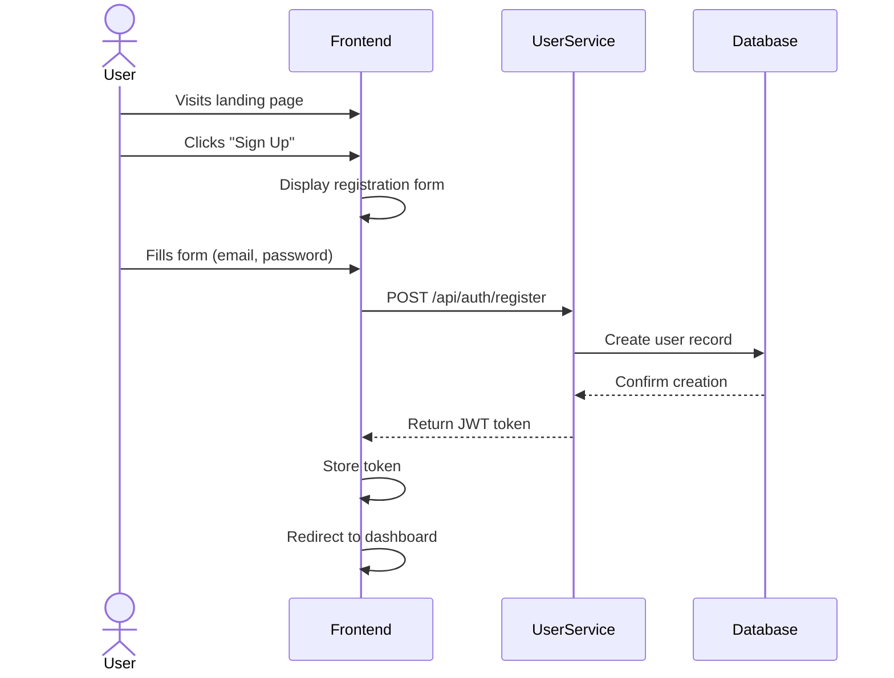
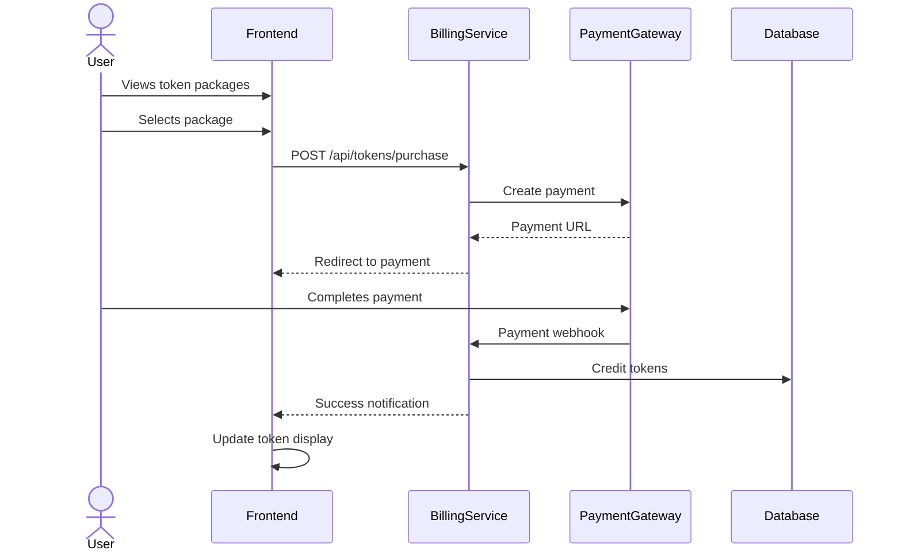
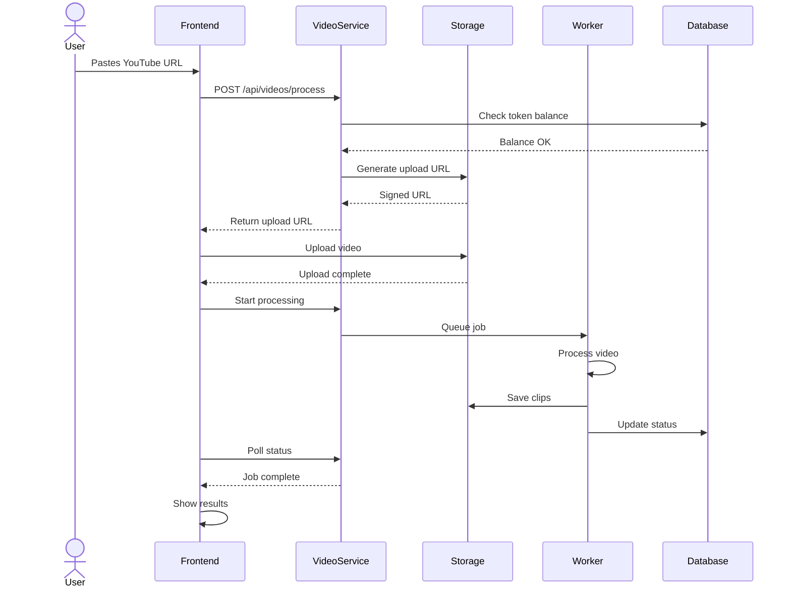
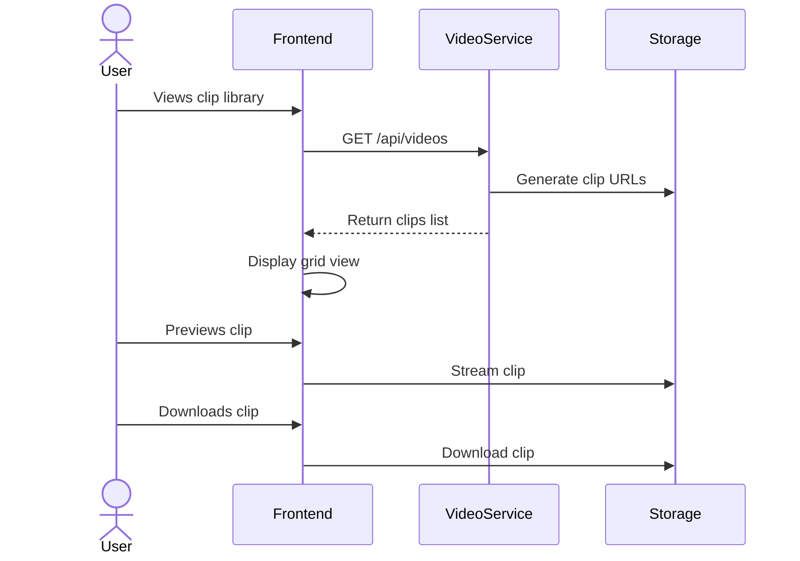
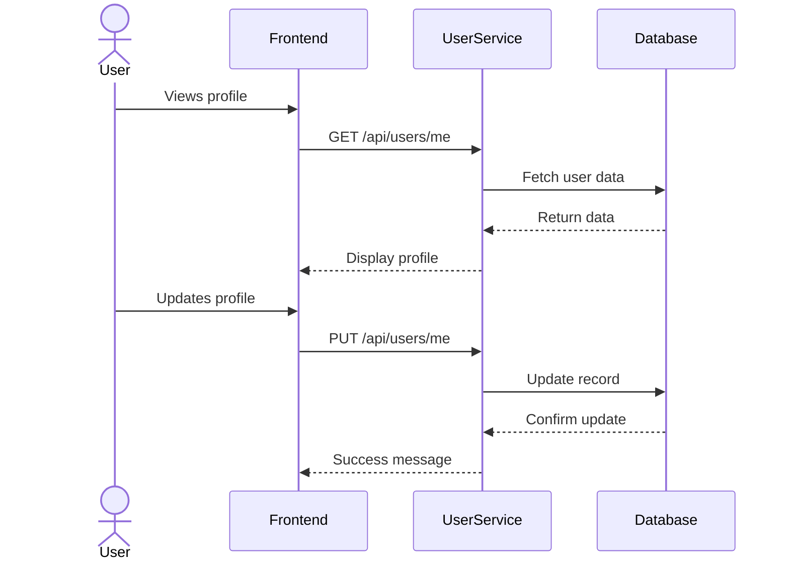
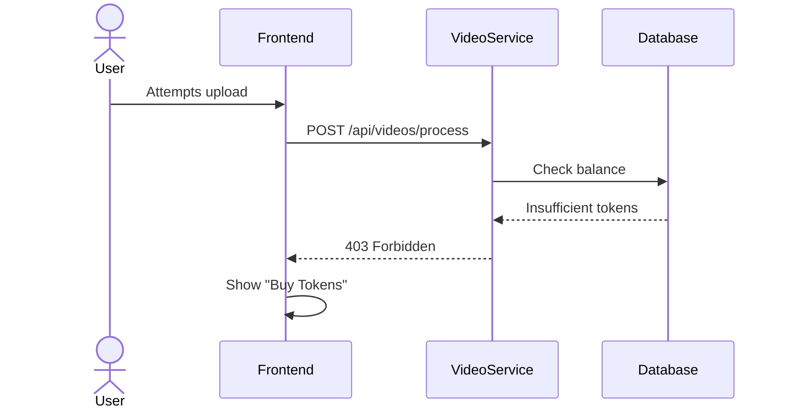
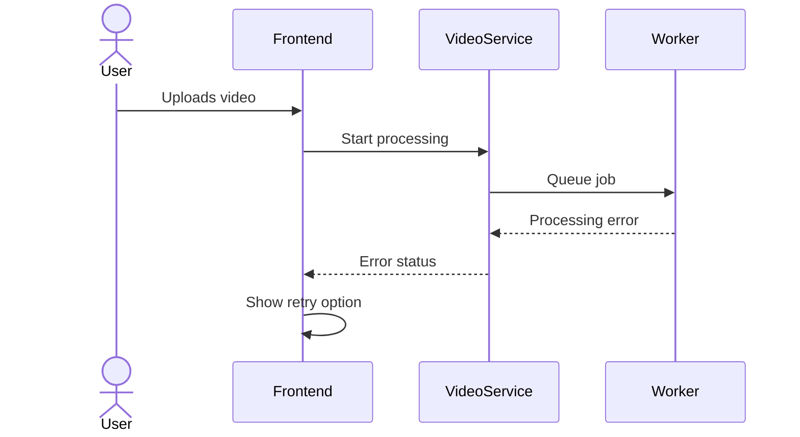
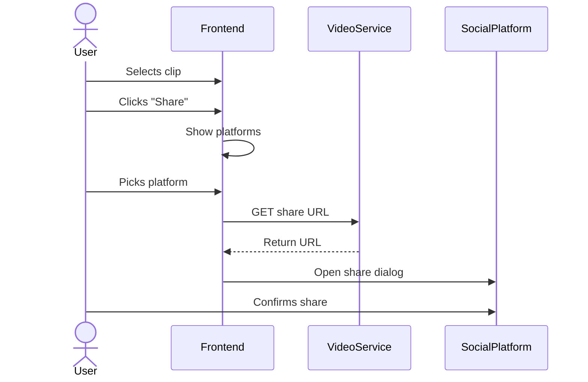

# User Flows

This document details the various user journeys through the Ravid Clipping platform.

## 1. New User Registration

### Success Criteria
- User account created
- JWT token received
- Redirected to dashboard
- Welcome email sent

## 2. Token Purchase Flow

### Success Criteria
- Payment processed
- Tokens credited
- Balance updated
- Receipt email sent

## 3. Video Processing Flow

### Success Criteria
- Video uploaded
- Processing started
- Clips generated
- Results displayed

## 4. Clip Management Flow

### Success Criteria
- Clips listed
- Preview works
- Download works
- Sharing enabled

## 5. Account Management Flow

### Success Criteria
- Profile viewable
- Updates saved
- History visible
- Settings applied

## 6. Error Handling Flows

### Token Depletion

### Processing Failure

## 7. Social Sharing Flow

### Success Criteria
- Platforms available
- Share dialog works
- Links valid
- Analytics tracked

## Key User Interactions

### Dashboard Elements
- Token balance display
- Recent videos grid
- Processing status
- Quick actions menu

### Video Upload
- URL input field
- Progress indicator
- Status updates
- Error messages

### Clip Management
- Thumbnail preview
- Duration display
- Download button
- Share options

### Account Settings
- Profile details
- Payment methods
- Email preferences
- API access

## Success Metrics

### User Engagement
- Sign-up completion rate
- Token purchase rate
- Video processing rate
- Clip download rate

### Technical Performance
- Upload success rate
- Processing success rate
- Average processing time
- Error rate

### Business Metrics
- User retention
- Token consumption
- Revenue per user
- Platform growth 